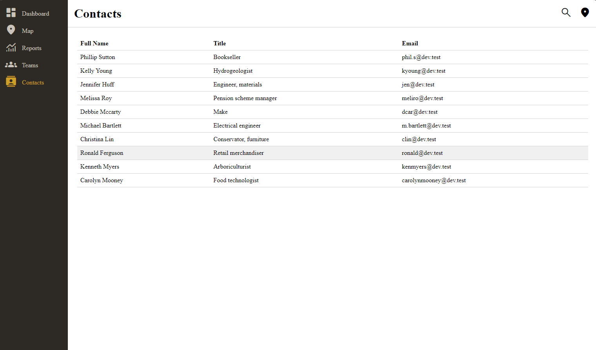

# Overview

This test is designed to assess your familiarity with our tech stack and give you insight into what it’s like to work with us.  
In addition to the core requirements, there are **Bonus Additions** at the end to help you stand out.

### Tech Stack
- Frontend Framework – [Vue 3](https://vuejs.org)
- Backend Framework – [Express JS](https://expressjs.com)
- JavaScript Runtime – [Node JS](https://nodejs.org)
- Icons – [Material Symbols](https://fonts.google.com/icons)
- Database – MongoDB (excluded from this test)

# Test Objective

You will build an application that displays a list of contacts in a table format. The test is divided into four parts, guiding you through component creation, backend integration, and full implementation.  
Once you complete the main sections, refer to the **Bonus Additions** to further improve your solution.

---

## Part 1 / 4: Create a Reusable Table Component

Build a reusable table component that accepts:
- An array of data objects
- An array of headers (column names)

The table should visually highlight a row when the user hovers over it.

> 💡 *A reference image is provided below, but you are encouraged to use your own design judgment.*

> 🌟 **Bonus Suggestion:** Make the table visually appealing and easy to style, as outlined in the Bonus section.

##### Helpful references:
- [Navigation Bar Component](./frontend/src/components/Navigation/NavBar.vue)
- [Icon Component](./frontend/src/components/Icon/Icon.vue)
- [Props Declaration in Vue](https://vuejs.org/guide/components/props.html#props-declaration)

---

## Part 2 / 4: Create a Backend Route

Create an Express route that returns a list of the company’s contact information.  
This data will later be displayed in your frontend table.

> ⚠️ *Note: The data source may contain issues — be prepared to handle or clean it if necessary.*

> 🌟 **Bonus Suggestion:** If implementing table filtering, consider supporting optional query parameters in this route.

##### Helpful references:
- [API Routes](./backend/src/routes/index.js)
- [Controller Example](./backend/src/controller/rootController.js)
- [Contact Data Source](./backend/src/json/contact_data.json)

---

## Part 3 / 4: Connect API to Frontend

Create a function in the API services file to fetch the contact data from the backend.  
This function should be reusable across the frontend.

> 🌟 **Bonus Suggestion:** If you’re implementing filtering, allow this function to accept parameters for filtering.

##### Helpful references:
- [API Services File](./frontend/src/services/api-service.js)

---

## Part 4 / 4: Display the Table with Data

Now that you have the table component and data-fetching logic, it’s time to bring everything together.  
Display the contact information in your table on the appropriate view.

> 🌟 **Bonus Suggestion:** Add a filter input field and apply styling updates during this step if desired.

##### Helpful references:
- [Contact View](./frontend/src/views/ContactsView.vue)
- [onMounted Lifecycle Hook](https://vuejs.org/api/composition-api-lifecycle.html#onmounted)

---

## Expected Result

You can use the following image as a rough visual reference for your final result.  
The final look does not need to match this exactly, your own styling decisions are welcome.

---

# Bonus Additions

## 1. Table Filtering

Enhance your table by adding a text input that filters the displayed contact data.  

> 💡 Can be implemented on the frontend or backend.

## 2. Table Reordering

Add the ability to reorder a column alphabetically.  
Each column header should include a button or clickable area that toggles the sort order (ascending/descending) for that column.

> 💡 Can be implemented on the frontend or backend.

## 3. Modernize the Styling

The current design of the application is outdated. Update the layout, typography, colors, or overall look to create a more modern and cohesive user interface.  
Feel free to use your own design preferences or reference current design trends.
