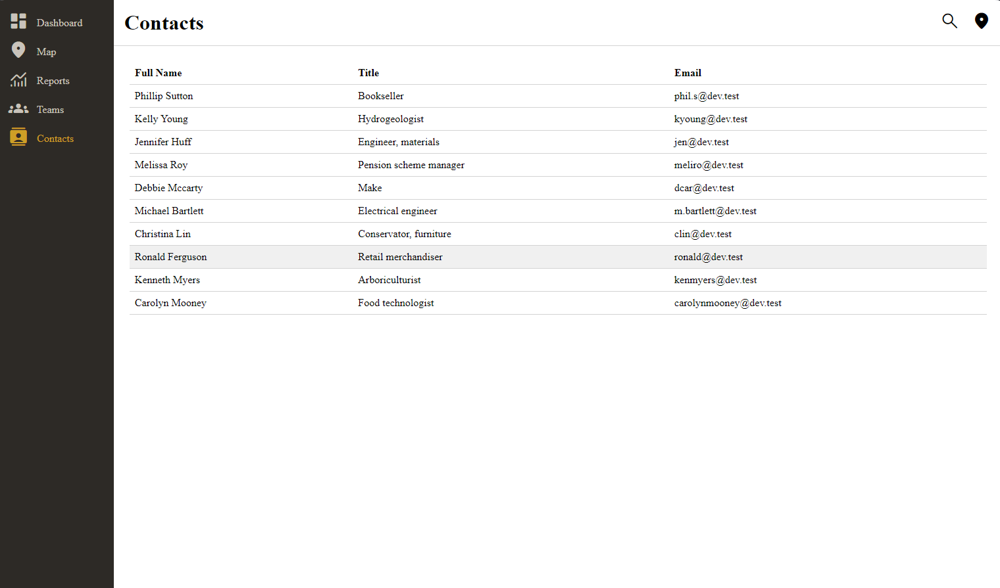

# Overview

This test is designed to see how familiar you are with our stack and to show you what you can expect from working here.

### Tech Stack Links
- Frontend framework - [Vue 3](https://vuejs.org)
- Backend framework - [Express JS](https://expressjs.com)
- JS Runtime - [Node JS](https://nodejs.org)
- Icons - [Material Symbols](https://fonts.google.com/icons)
- Database - MongoDB (Excluded from test)

# Test
The application needs a table to display a list of all the available contacts. 

This test is broken up into parts to help give a direction of steps to take.

## Part 1 / 4: Table Component
Your task is to create a basic Table Component that can be used in multiple places.
This table needs to take in an array of data, along with headers.
When the user hovers over a table row, the background of the table row should change color.

<i>* There is a reference image below but ultimately the table design is up to you.</i>

##### Helpful references:
- [Navigation Bar Component](./frontend/src/components/Navigation/NavBar.vue)
- [Icon Component](./frontend/src/components/Icon/Icon.vue)
- [Props Declaration](https://vuejs.org/guide/components/props.html#props-declaration)

## Part 2 / 4: Backend Route
Your task is to create a backend route to retrieve the company's contact information.

<i>The `Data Source` might be broken.</i>

##### Helpful references:
- [API Routes](./backend/src/routes/index.js)
- [A Controller Example](./backend/src/controller/rootController.js)
- [Data Source](./backend/src/json/contact_data.json)

## Part 3 / 4: Linking the API and Frontend
Your task is to create function in `API Services` that retrieves the company's contact information so it can be imported across the frontend.

##### Helpful references:
- [API Services](./frontend/src/services/api-service.js)

## Part 4 / 4: Showing the Table with Data
Now that you have a table component and you should be able to retrieve data from the backend, your task is to join it all together to display the end result. 

##### Helpful references:
- [Contact View](./frontend/src/views/ContactsView.vue)
- [OnMounted](https://vuejs.org/api/composition-api-lifecycle.html#onmounted)

## End Result:
Feel free to deviate from this image. You shouldn't care about being pixel perfect for this test.

